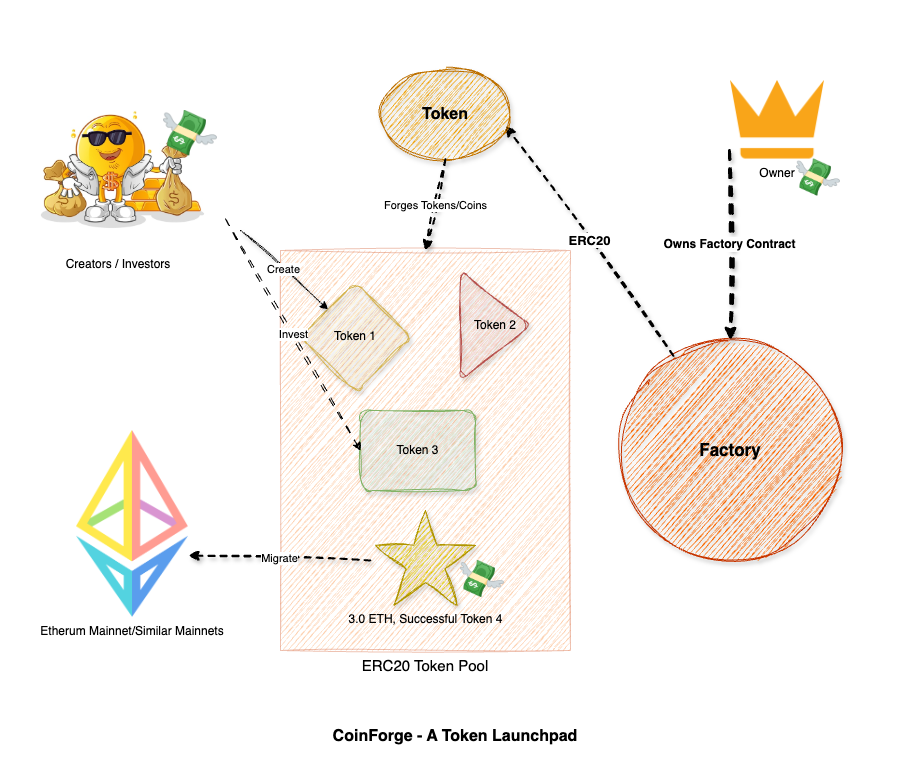
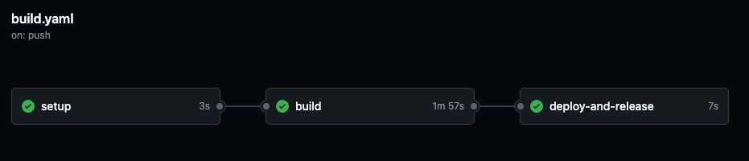
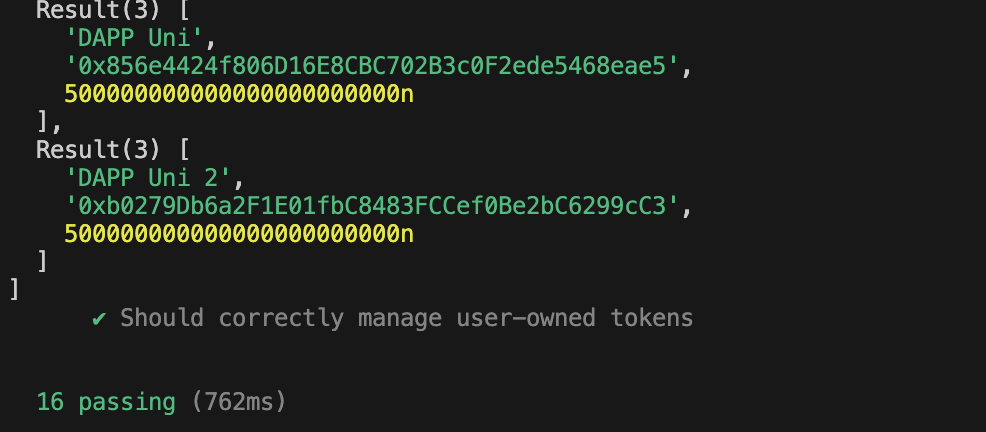
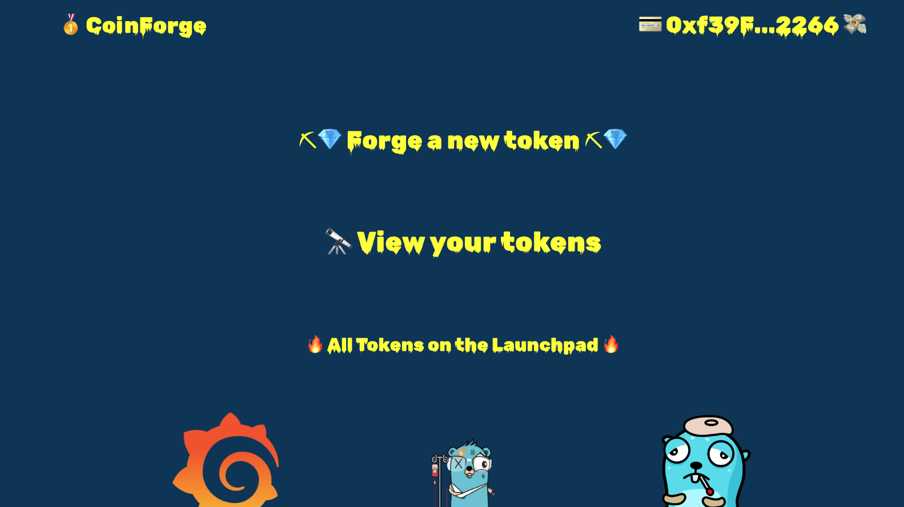
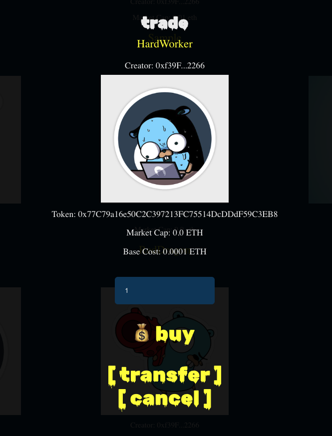

# CoinForge

## About project

To run, find steps [here](#to-run).
View application [kr-r.me](https://kr-r.me)

This project, CoinForge, aims to create a decentralized marketplace for the simplified
creation and immediate trading of novel digital assets.

This project is to build a decentralized marketplace, CoinForge, where users can easily
define and launch new digital assets. The marketplace's core features will be:

1. Streamlined Asset Definition: An intuitive interface for users to specify the
properties of their digital asset for listing on the marketplace
2. Automated Trading Mechanism: Implementing an innovative contract-based
system that facilitates the immediate buying and selling of these assets within
the marketplace based on a predefined algorithm or model.
3. Basic Marketplace Interface: A web interface allowing users to connect their
wallets and interact with the marketplace's asset creation and trading
functionalities.

The initial scope will concentrate on these fundamental marketplace aspects, with
potential future expansions considering features like asset discovery, community
engagement, and enhanced trading tools.

## Business Philosophy and Working



- `Owner` owns the `Factory` contract which makes use of `Token` contract that implmenets `ERC20` tokens.

- `Investors/Creators` are the audience for this website, who visit and either creates a new token/coin or invests in existing token.

- Every ERC20 Token thus created will be available for purchase until it reaches popularity (Funded upto 3.0 ETH) or till the Creator chooses not to dilute the token.

- In the end, successfully funded tokens can be transfered to Mainnets like Ethereum etc.,

## Token & Economy

- A Token value, referred as `base-cost` will increase as `investors` keep investing. It is calculated against the available `market-cap` available in a given Token.

- On creation every token will have `market cap` of `500,000 WEI`; all of them assigned to the Creator. When a purchase is made for `x` number of tokens, creator sells them for a value and investors inherit `x` number of tokens in their posession. Thus value of token goes up.

- On successful funding, creator can - wishe to dilute the token and take the revenue generated so far or migrate the token to a mainnet like Ethereum.

## Wallet Configuration

The wallet on which this application is a custom testnet based on top of hardhat.

Configuration is as below:

Network Name: `KR Testnet`
Default RPC URL: `http://kr-r.me:8545`
Chain ID: `31337`
Currency Symbol: `ETH`

If you want a test account to play with 

```
Account #0: 0xf39Fd6e51aad88F6F4ce6aB8827279cffFb92266 (10000 ETH)
Private Key: 0xac0974bec39a17e36ba4a6b4d238ff944bacb478cbed5efcae784d7bf4f2ff80

Account #1: 0x70997970C51812dc3A010C7d01b50e0d17dc79C8 (10000 ETH)
Private Key: 0x59c6995e998f97a5a0044966f0945389dc9e86dae88c7a8412f4603b6b78690d
```


## Hosting Information

The website is hosted on a custom testnet created using `hardhat` on a remote machine behind [kr-r.me](https://kr-r.me/).

A CICD workflow is designed for this over here - 


## Technology Stack & Tools

- Solidity (Writing Smart Contracts & Tests)
- Javascript (Next.js & Testing)
- [Hardhat](https://hardhat.org/) (Development Framework)
- [Ethers.js](https://docs.ethers.io/v5/) (Blockchain Interaction)
- [Next.js](https://nextjs.org/) (Frontend Framework)

## Testing and TestCases

All the functions within Factory contract are tested and can be found over [here](./test/Factory.js) 



## UI Screens





## PreRequesties
- NodeJS

## To Run

Make sure you have [configured your wallet](#wallet-configuration), if testing [live site](https://kr-r.me)

### 1. Clone/Download the Repository

### 2. Install Dependencies:
`$ npm install`

### 3. Run tests
`$ npx hardhat test`

### 4. Start Hardhat node
`$ npx hardhat node`

### 5. Run deployment script
In a separate terminal execute for local test:

`$ npx hardhat ignition deploy ignition/modules/Factory.js --network localhost`

If you have previously deployed you may want to append `--reset` at the end:

`$ npx hardhat ignition deploy ignition/modules/Factory.js --network localhost --reset`

If you want to make changes at remote, use `--network remote`

### 6. Start frontend
`$ npm run dev`